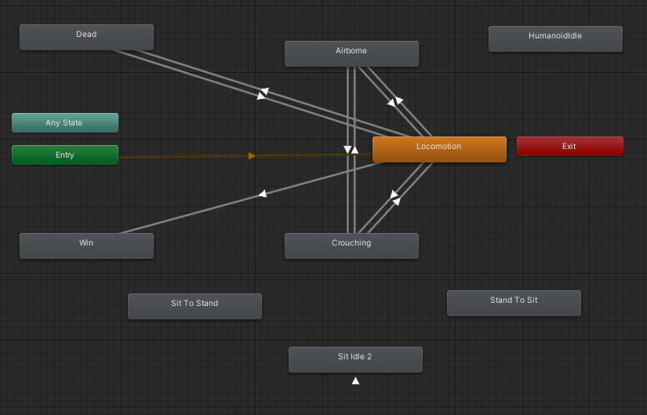
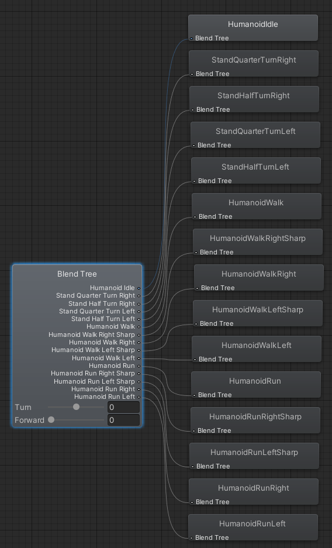
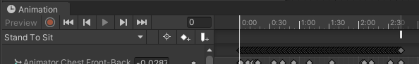
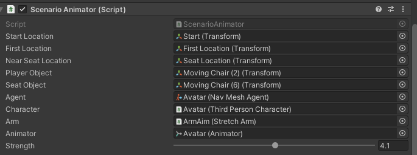
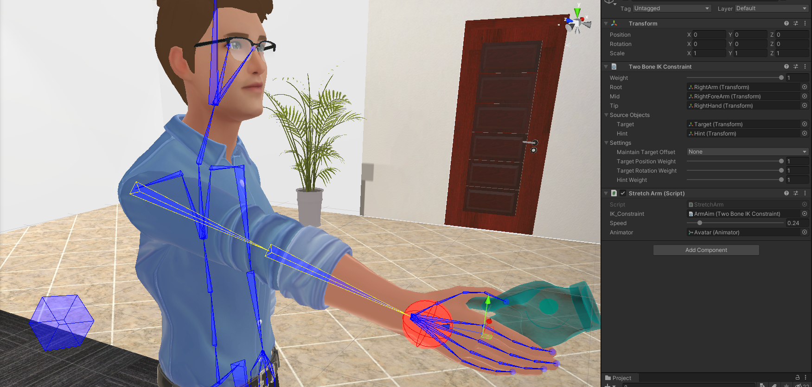

# Office Space / Haptic Hand

In this file we will describe parts and techniques used in the office scene which is used.
For setup information on the Haptic Hand (vibrotactile and Dexmo), we refer you to [the Setup File](Setup.md)

In this file the goal is to go through different technology parts which are used in the Office Space which can be useful for other HMI projects or ITech thesis.

For the rest of this file, we will use the following formating

- "    "     - Path of items
- **bold** - Object
- _italics_ - Window
- unstyled - component of an object / toolbar button 

## Avatar
The avatar used is build through [ReadyPlayer.me](https://readyplayer.me/), a website through which you can build a 'virtual human' A.K.A. an avatar.
Loading a different Avatar can be achieved through the toolbar.
These avatars should come pre-rigged for animation.
However, as some extra items have been added to the Avatar, re-loading or changing the avatar might undo this.

## Movement
The movement of the Avatar can be separated in a few parts. These will be described below


### General Movement
Movement of the Avatar is taken care of by the Animator.
You can find the animator in the toolbar "Window -> Animation -> Animator".
The animator should look like the image below.

.

The key parts of the movement are take care of by the [Third Person Character script](Haptic%20Hand/Assets/Example05%20-%20LowMan/LowMan/Scripts/ThirdPersonCharacter.cs).
This script is taken from a [Bracky's Youtube Video](https://www.youtube.com/watch?v=blPglabGueM) and edited.
With the current settings the Avatar should generally refrain from jumping or running most of the time.

The animator uses the Locomotion state of the animator. 
The Locomotion state is itself a Blendtree of different animation states.
A Blendtree is a collection of animation states which can be partially activated.
This activation needed is calculated in the previously mentioned [Third Person Character script](Haptic%20Hand/Assets/Example05%20-%20LowMan/LowMan/Scripts/ThirdPersonCharacter.cs).
The Blendtree can be seen in the image below.


#### Specific Animation Movement
In the Animator image shown above, there are a total of 4 'disconnected' states.
These states are triggered in the ScenarioAnimator described below and are used to create specific movements.
Furthermore, they also make use of Animation Events. These will both be described later on.

### Animation Events
Within the 'freefloating' animation states a small, easily overseen technique is hidden: Animation Events. 
These events are triggered when the animation passes the point on which they are placed.
When this happens you can 'catch' these events in code.
The animation events can be seen as the small white pointer just past 2:30 in the animation below.




### Navmesh
The entire office environment contains a so-called 'Navmesh' which is used to make the Avatar able to navigate to 
The NavMesh layout can be seen when the _Navigation_ window is open.
To open the _Navigation_ window, from the toolbar "Window -> AI -> Navigation".

It is easily seen if the _Navigation_ window is open as this will project a blue transparent layer on top of the floor.
This blue layer is the actual Navmesh.
Objects can be in- or excluded based on the navigational needs. For more info, see [this Bracky's tutorial on Navmesh](https://www.youtube.com/watch?v=CHV1ymlw-P8). 

### Nav Mesh Agent
To make the avatar interact with the Navmesh, the Nav Mesh Agent component is added.
This can be found under "**Avatar** -> _Inspector_ -> Nav Mesh Agent".
This agent is also the main part used to make the avatar move.
When moving, the Third Person Character script then takes care of the animation (in the Locomotion state).

### Scenario Animator
The [Scenario Animator](Haptic%20Hand/Assets/Luuklsl/Scripts/ScenarioAnimator.cs) is the part from which the entire (current) interaction is built.
The Scenario Animator can be found under "**Avatar** -> _Inspector_ -> Scenario Animator (Script)".
This script takes a number of objects (try double clicking on them to find in which object/location they hide) and uses these to move the Avatar around to pre-specified locations.



The key components of the interaction come together in this script.
The locations (Start, First, Near Seat) hide just underneath the floor and are used to navigate towards.
To do this, the NavMeshAgent is called to navigate towards that (x,y,z) location as best as possible.

The Navmesh agent will always keep navigating towards it's goal, even if it has been reached. For this reason some helper functions are built to know when a next step can be taken.
These helper functions will be explained below.
The ScenarioAnimator script itself has a number of comments which should be able to guide you through to understanding what it does.

The previously mentioned Animation Events are used to know when certain parts of the animation have passed and we can continue on with a pre-set different movement.
E.g.: We can know when we can start moving again when standing up. Or when we need to rotate the chair because the sitting animation has finished.

### Reaching out

To make the avatar reach out towards the user we make use of Animation Rigging.
The specific form of Animation Rigging we are talking about does not focus on the placement of 'bones' in a model, but rather focussing on using this setup in a constrained way to implement specific movements.

In the image below we see a TwoBoneIKConstraint in action in combination with the Dexmo gloves.
By applying a Rig Constraint on the arm we have a method to move the arm towards a target, in this case the red ball.
In our case we added a Lerp movement on the target so that the avatar needed to catch up in moving his own hand at times.

Many different forms of constraints exist. The best option is to explore the options yourself based on your specific needs.
For more info see [this tutorial video by Brackys](https://www.youtube.com/watch?v=Htl7ysv10Qs), or the [wiki on this specific package](https://docs.unity3d.com/Packages/com.unity.animation.rigging@0.2/manual/index.html).



### Helper functions
To aid in solving some recurring annoyances, a file with two Helper methods was made. The helper file can be found under "_Project_ -> Assets -> Luuklsl -> Scripts -> Helpers" (the file should appear on the right-hand side of the project window).
On Github it can be found [here](Haptic%20Hand/Assets/Luuklsl/Scripts/Helpers.cs)

The two methods will be discussed below

```
public static float HorizontalDistance(Vector3 a, Vector3 b)
```
The HorizontalDistance method is fairly simple.
Instead of the distance between two objects in 3D space, we want to evaluate the distance in horizontal space, also known as the X and Z directions in Unity.
To evaluate this, we take in two 3D vectors, ignore the Y-value, and return the distance between point a and point b as a float.
This helps in our case as we have 'visible' navigation points underneath the floor. 
Instead of perfectly matching this up in the floor and making them disappear, we only look at a horizontal distance. 


```
public static bool RotateTowardsObject(Transform focusObject, Transform turningObject, float offset = 0,
            float strength = 1f, float stopDeviation = 4f)
```
The RotateTowardsObject method is a bit more complex in its internals, but easy in its use.
The goal of this method is two-fold:
 - Move the "turning object" towards the "focus object"
 - Return a boolean value which states if we are close enough to the desired rotation.

As we are using rotations, we use Quaternions internally. 
These are a complex idea, but are great for use in rotations.
For the end user, the key points that need to be understood luckily don't have to do with these pieces of math madness.

The end-user is expected to give a 'focus object' which the 'turning object' should look at.
However, it can happen that models don't align how you expect them, i.e. the model has been designed from a different angle than was expected making them align rotated after use.
To prevent this from being an issue, we use the optional argument 'offset', which should be given as degrees.

We can also control the speed of the rotation with the optional 'strength' argument to speed up or slow down the rotation.
Finally, as we use the Lerp somewhat 'incorrectly', we have added a distance at which the rotation is considered good enough, this argument can also be set separately if needed.

Note on the Lerp: we recalculate each and every frame to give a more natural smoothing of movement at the end, instead of using a calculate once, do till close approach. this is considered 'incorrect' due to the chance of infinite repetition.
However, for our case it gives us a slowdown at the end of the rotation, which feels more human-like than a sudden drop.

## Audio
As the goal was to make an as natural as possible interaction, the choice was made to give the Avatar some 'speaking' capabilities, through the use of pre-recorded audio fragments.
Furthermore, we also wanted to make the Avatar seem like he was actually speaking.
Both prats will be discussed below

### Audio Controller
To trigger the audio at the right time in the right order, we chose to create a fairly simple Audio Controller.
Script can be found either at "**Avatar** -> _Inspector_ -> Audio Controller" or on Github [here](Haptic%20Hand/Assets/Luuklsl/Scripts/AudioController.cs).

The script allows for an unlimited amount of audio-clips which need to be played in order. Furthermore, the controller automatically loops the audio fragments.

Next to the looping, the possibility of specific responses is also built in. 
Currently this is set up by using three specific fragments linked to specific keys.

### Oculus Lipsync
To make the avatar seem to talk naturally, some mouth-movement is needed.
To achieve this, we made use of a library called ["Oculus Lipsync"](https://developer.oculus.com/documentation/unity/audio-ovrlipsync-unity/).
This library uses the audio from an audio source (in our case the avatar), and translates this into visemes, which are the 'mouth shapes' a human would make for a certain sound.
To show these, the library applies these to the Avatar by using "blendshapes" on the face of the avatar.

These blendshapes can be found under "**Avatar** -> **Skin** -> **Wolf3D.Avatar_Renderer_Head** -> _Inspector_ -> Skinned Mesh Renderer" and then scrolling to the bottom.
As these blendshapes are floats from 0 to 100, a large combination of shapes can be created this way, making the avatar seem somewhat realistic, and extremely adaptable to any kind of audio!

As of right now the library is still kind of prone to breaking, especially when it comes to Audio Source selection and some debugging options.
However, when it works, it looks pretty amazing.

**It is recommended to make a back up of settings when you have it working, as changing things could break it again** 


## Feather - Unity Communication

The communication between the [Feather](https://www.adafruit.com/product/3405) (basically a wireless arduino) and Unity is two-sided.
To find specific setup-information, we once again refer you to [the Setup File](Setup.md).

The Feather side of the communication can be found under "_Project_ -> Assets -> Luuklsl -> Scripts -> Arduino-code -> Feather_wireless -> Feather_wireless (script)", or [here on Github](Haptic%20Hand/Assets/Luuklsl/Scripts/Arduino-code/Feather_wireless/Feather_wireless.ino)
This code is written in the Arduino editor, but can be opened by any program. For uploading any changes to the feather, the steps in the setup need to be followed to first set it up, then pushed using the Arduino Editor.

The script is two-sided.

The first steps are setting up the Wifi connection to a specified router. This router needs to be set according to what you are using!
Furthermore, you will need to know the IP address of your pc according to your router (if internally), or on the internet (if externally, not tested)
You can find this IP address by writing ``ipconfig -all`` ind your command prompt of choice (windows). 
The address you need is to be set to the IPV4 address of the output.
It is recommended to set this up while connected to the pc using the serial monitor of the Arduino editor.

The second side of the script is parsing commands and pushing them towards the set pins (13, 12, 27, 33 for Channel 1 to 4 respectively)

The Unity side exists of the [BaseVibration Script](Haptic%20Hand/Assets/Luuklsl/Scripts/VibrationScripts/BaseVibrationScript.cs), which handles the parsing of info into correct JSON, and the [ServerClient script](Haptic%20Hand/Assets/Luuklsl/Scripts/VibrationScripts/ServerClient.cs), which sends and receives messages.

## Other Scripts
The parts described above are the main interaction, however, some other scripts have also been written. We will discuss these here shortly.

### Follow Target Object Smooth
[This script](Haptic%20Hand/Assets/Luuklsl/Scripts/FollowTargetObjectSmooth.cs) makes sure that items follow a target in a smooth way instead of being perfectly followed.
It uses the same idea as the rotation in helpers, but now for movement.
The user can add its own offset so that the target follows with this offset.
This can help in making targets match better positionally.

### FPS counter
[FPS counter](Haptic%20Hand/Assets/Luuklsl/Scripts/FpsCounter.cs), useful for quick debugging when things seem slow. 
Does not work well with the HMD projection, so only useful in the scene view of Unity.

### Look At Head of Participant
[A script](Haptic%20Hand/Assets/Luuklsl/Scripts/LookAtHeadOfParticipant.cs) which makes the Avatar track the participants face.
Basically updates the location of the HeadTarget object so that the focus seems to be on the user.

### Rotate Towards HMD Look Direction
[A script](Haptic%20Hand/Assets/Luuklsl/Scripts/RotateTowardsHmdLookDirection.cs) which rotates the chair on which the user sits towards the direction the user is approximately looking
Can toggle between strict and non-strict.
Can also be set to not rotate.
The idea is that the user starts by standing, looking around a bit. At this point the chair should not yet move.
When the user sits down, the chair should be set to rotate and strict, so that the chair is rotate in the same direction as the user.
When looking towards the Avatar, this strictness can be removed, so that the user can look around a bit.
When the user stands up again, you obviously do everything in reverse.

### Set Tracked Device ID
[A script](Haptic%20Hand/Assets/Luuklsl/Scripts/SetTrackedDeviceID.cs) which runs through all objects available and checks if they are a tracker.
As we only use one tracker, the moment we find one we set that to be the Tracked Object.
Something similar can be used with the specific Device ID's if more trackers are in use.


